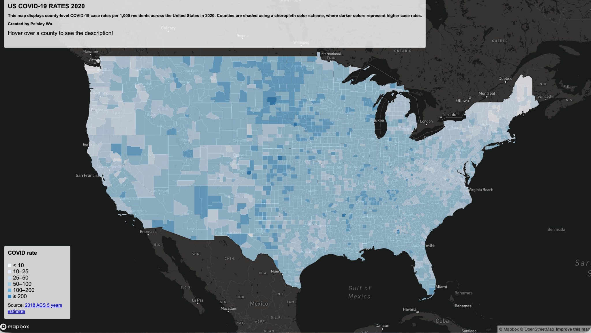
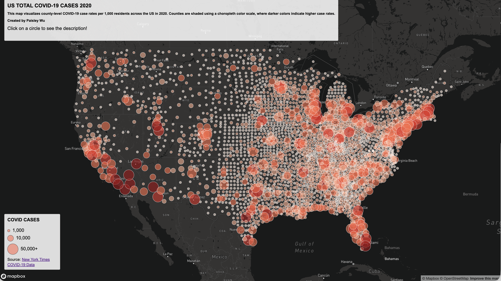

# PaisleyGEOG458lab3

# US COVID-19 Cases Mapping (2020)

## Introduction
In this lab, I aim to present 2 interactive web maps visualizing by the COVID-19 data across the United States in 2020. The goal of the project is to explore spatial patterns in COVID-19 spread using different thematic mapping techniques.

## About the Maps
- **Map 1: US COVID-19 Rates 2020** 

Here I used a choropleth map to show the county-level COVID-19 case rates and used a sequential color scale.  
Function: Users can hover over counties to see the county name, state, and the covid rate in the top left bar.
[Open Map 1](https://paisleyw829.github.io/PaisleyGEOG458lab3/map1.html
)

- **Map 2: US TOTAL COVID-19 CASES 2020**

Here I used proportional circle map where circle size represents total COVID-19 cases at each county level.  
Function: Users can click on those circles to view detailed information.
[Open Map 2](https://paisleyw829.github.io/PaisleyGEOG458lab3/map2.html
)

## Libraries and Tools
- **Mapbox**
- **HTML**
- **CSS**
- **GeoJSON data format (mapshaper)**

## The Primary Function
- Loading external GeoJSON data using `fetch()`
- Adding data sources and layers with `map.addSource()` and `map.addLayer()`
- `mousemove` events for hover-based tooltips (Map 1)
- `click` events for popups (Map 2)

## Data Sources
- **COVID-19 Rate**:  
  2018 ACS 5 year estimates (the population data)  
  https://data.census.gov/cedsci/table?g=0100000US.050000&d=ACS%205-Year%20Estimates%20Data%20Profiles&tid=ACSDP5Y2018.DP05&hidePreview=true

- **COVID-19 case/death data**:  
  The New York Times
  https://github.com/nytimes/covid-19-data/blob/43d32dde2f87bd4dafbb7d23f5d9e878124018b8/live/us-counties.csv 

- **Basemap**:  
  mapbox://styles/mapbox/dark-v10 

## AI Usage Statement
AI tools were used in a limited in this lab assignment.
- Debugging syntax errors
- Clarifying Mapbox error messages and unexpected behavior
- Conceptual hints about thematic mapping techniques and Mapbox expressions

## Credits
Made by Paisley Wu

## Acknowledgements
- Map design inspired by coursework and examples from **GEOG 328** and **GEOG 458**
- Thanks to course instructor and TAs for guidance and instructions on web mapping concepts and Mapbox usage

